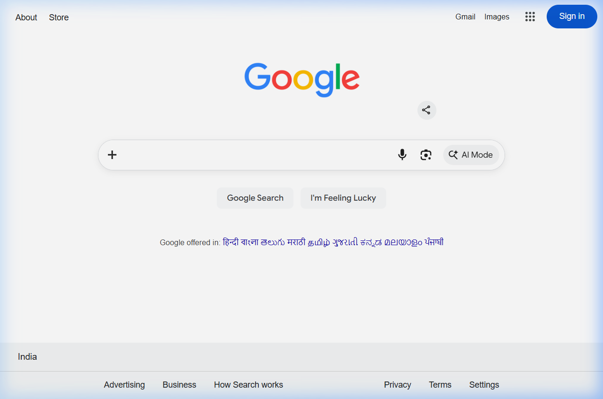
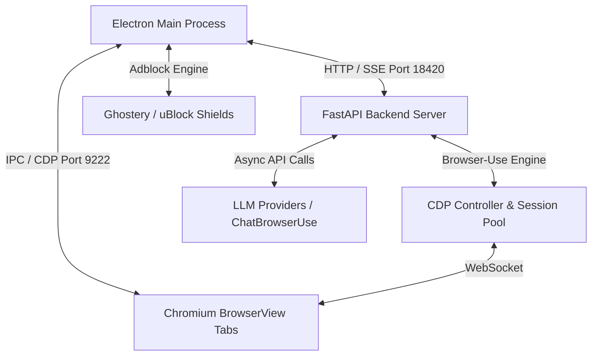

<div align="center">
  
  <h1>🪐 Pluto Agent Browser</h1>
  <h3>The AI-Native, Ultra-Fast Autonomous Chromium Browser</h3>
  <p><i>Execute web automation tasks at unprecedented speeds with integrated visual glow signals, stealth adblocking, and multi-model intelligence.</i></p>

  <p>
    <a href="#-performance-benchmarks"></a>
    <a href="LICENSE"></a>
    <a href="#-tech-stack"></a>
    <a href="#-getting-started"></a>
  </p>
</div>

---

## 🌟 Highlights

Pluto Agent Browser is a next-generation desktop web browser built from the ground up for **agentic web interaction**. By combining a native Electron multi-tab shell with a high-performance Python FastAPI backend and a tuned `browser-use` CDP controller, Pluto allows AI agents to browse, interact, and solve complex web workflows side-by-side with humans.

### Key Capabilities

- ⚡ **Antigravity-Level Speed Mode**: Sub-5-second execution on routine tasks through $O(1)$ context window pruning (`max_history_items=6`), zero-wait hydration handling, and parallel CDP pre-flights.
- 🔵 **Active Control Glow Signal**: Real-time visual feedback with an animated blue gradient aura when the AI agent takes control of the screen. Toggleable in user settings.
- 🛡️ **Stealth Shields & Built-in Adblocker**: Native integration of Ghostery/uBlock adblocking engine to prevent tracking scripts, reduce DOM bloat, and improve agent navigation speed.
- 🧠 **Multi-Model Intelligence**: Seamless switching between `ChatBrowserUse`, `Claude 3.5/4.6`, `Gemini 2.5/3.5`, `OpenAI GPT-4o`, and local LLMs via `Ollama`.
- 🧰 **Extensible Skill System**: Built-in support for specialized skills (e.g. Canva design recreation, CodeChef module automation, and custom workflow scripts).

---

## 📸 Screenshots

### Agent Sidebar Interface
Interact with the browser side-by-side with the AI assistant, featuring live telemetry logs and performance metrics.



---

## 🚀 Performance Benchmarks

Pluto incorporates an aggressive time-complexity optimization pipeline to eliminate latency drivers (DOM bloat, DNS fallback delays, event-loop starvation, and redundant LLM roundtrips):

| Metric | Standard Mode | Fast Mode (Antigravity Speed) | Optimization Applied |
|---|---|---|---|
| **Context Complexity** | $O(N)$ (Full History) | **$O(1)$ (`max_history_items=6`)** | Strict step history pruning |
| **Screenshot Size** | Full Resolution | **Resized ($800 \times 500$)** | 4× image token payload reduction |
| **Navigation Overhead** | 5s sleep + tab scan | **Instant IPC routing** | Electron same-tab bypass |
| **Cold Start ("open google")** | ~45–60s | **~9.95s** | Parallel CDP pre-flight + async scanning |
| **Warm Repeat Task** | ~30s | **~4.73s** | Persistent CDP connection pool |

---

## 🛠️ Architecture



- **Frontend**: Electron shell with customizable sidebar tabs, dark theme, adblocker shields, and animated glow signal.
- **Backend API**: Python FastAPI server providing streaming SSE endpoints for agent steps and model control.
- **Agent Engine**: Customized `browser-use` framework optimized for CDP target focus and fastDOM traversal.

---

## 📦 Getting Started

### Prerequisites

- **Python**: `>= 3.11` (Python 3.12 recommended)
- **Package Manager**: [`uv`](https://github.com/astral-sh/uv) (recommended) or `pip`
- **Node.js**: `>= 18.0`

### Installation

1. **Clone the repository**:
   ```bash
   git clone https://github.com/goutham-11-16/Pluto-Agent-Browser.git
   cd Pluto-Agent-Browser
   ```

2. **Set up Python environment**:
   ```bash
   uv venv --python 3.12
   # On Windows (PowerShell):
   .venv\Scripts\activate
   # On macOS/Linux:
   source .venv/bin/activate

   uv sync
   ```

3. **Install Desktop Shell dependencies**:
   ```bash
   cd pluto-browser
   npm install
   ```

4. **Configure API Keys**:
   Create a `.env` file in the project root directory:
   ```env
   BROWSER_USE_API_KEY=your_key_here
   # Optional fallback keys:
   GOOGLE_API_KEY=your_google_key
   OPENAI_API_KEY=your_openai_key
   ANTHROPIC_API_KEY=your_anthropic_key
   ```

### Running Pluto Agent Browser

Start the desktop browser application in development mode:

```bash
cd pluto-browser
npm start
```

This automatically launches the Electron shell and spawns the FastAPI backend server on `http://127.0.0.1:18420`.

### 📦 Building Windows Application (.EXE)

You can build a standalone Windows Installer executable (`.exe`) or a single-file Portable executable (`.exe`) using `electron-builder`:

```bash
cd pluto-browser

# Build NSIS Installer (.exe)
npm run dist

# Build Single-File Portable Application (.exe)
npm run dist:portable
```

The output executables are generated in `pluto-browser/dist/`:
- 📥 **Installer**: `dist/Pluto Agent Browser Setup 1.0.0.exe`
- ⚡ **Portable App**: `dist/Pluto Agent Browser 1.0.0.exe`
- 📂 **Unpacked Binary**: `dist/win-unpacked/Pluto Agent Browser.exe`

---

## ⚙️ Configuration & Fast Mode

You can configure execution parameters directly in **Settings → Pluto AI**:

- 🚀 **Fast Mode**: Enables sub-5-second execution with flash reasoning, low-detail screenshots, and $O(1)$ history pruning.
- 💡 **Agent Control Glow**: Toggles the glowing blue border when the agent takes over screen interaction.
- 🎯 **Max Steps**: Set maximum step limits per task (Default: `25`).
- 🤖 **Model Selection**: Switch dynamically between `ChatBrowserUse`, Claude, Gemini, OpenAI, or local models.

---

## 📜 License & Open Source Attribution

Pluto Agent Browser is open-source software licensed under the **[MIT License](LICENSE)**.

### Credits & Acknowledgments
Pluto is built upon and incorporates work from the following open-source projects:

- **[Browser-Use](https://github.com/browser-use/browser-use)** — Core browser automation engine and agent framework (MIT License).
- **[Electron](https://github.com/electron/electron)** — Cross-platform desktop application framework (MIT License).
- **[Ghostery Adblocker Electron](https://github.com/ghostery/adblocker)** — High-performance adblocking & tracking protection engine (MPL-2.0 / MIT License).
- **[FastAPI](https://github.com/fastapi/fastapi)** & **[Pydantic](https://github.com/pydantic/pydantic)** — Backend server API and data validation (MIT License).

---

<div align="center">
  <sub>Built with ❤️ by the Pluto Agent Browser community.</sub>
</div>
<!-- run `browser-use skill install` to register the skill -->
